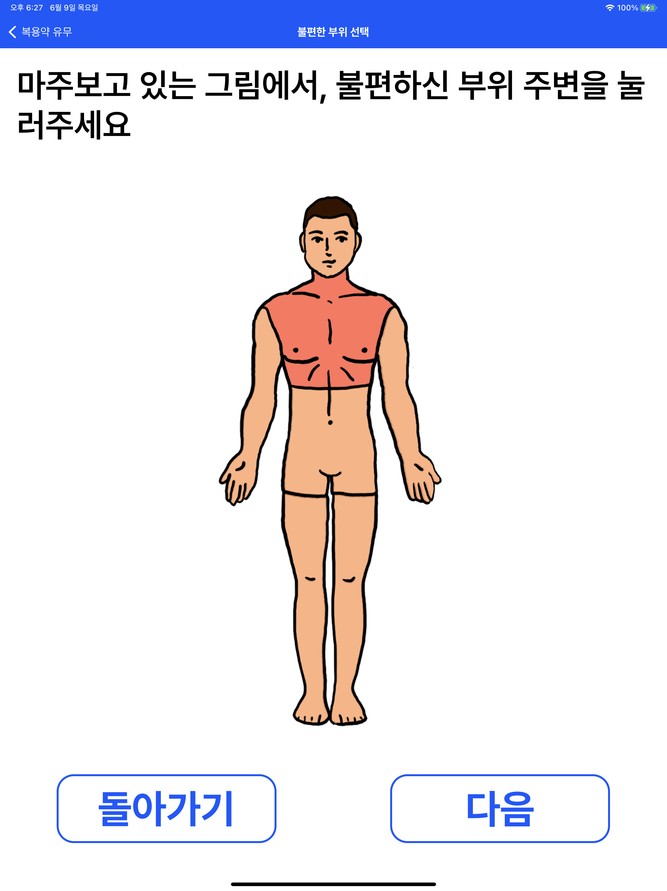
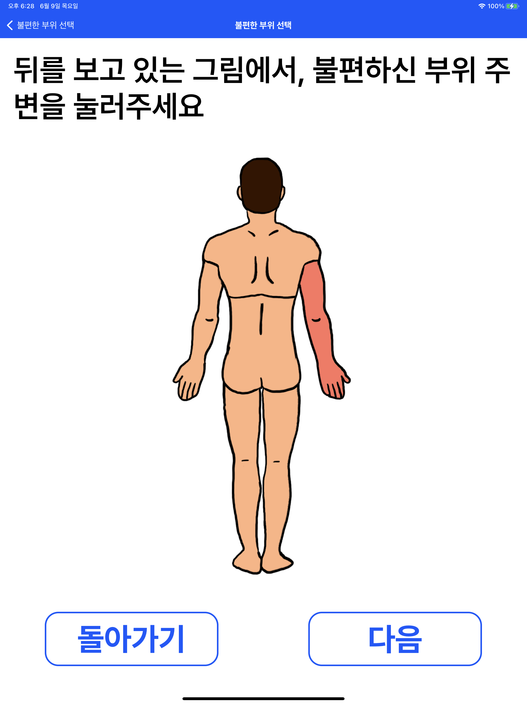
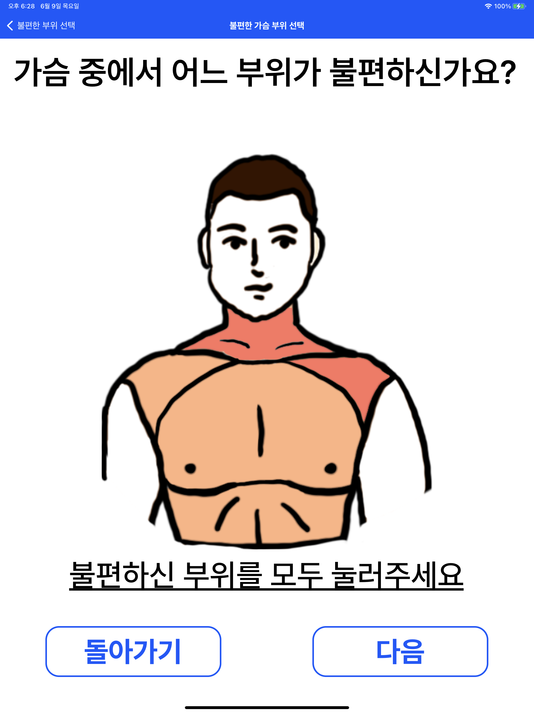
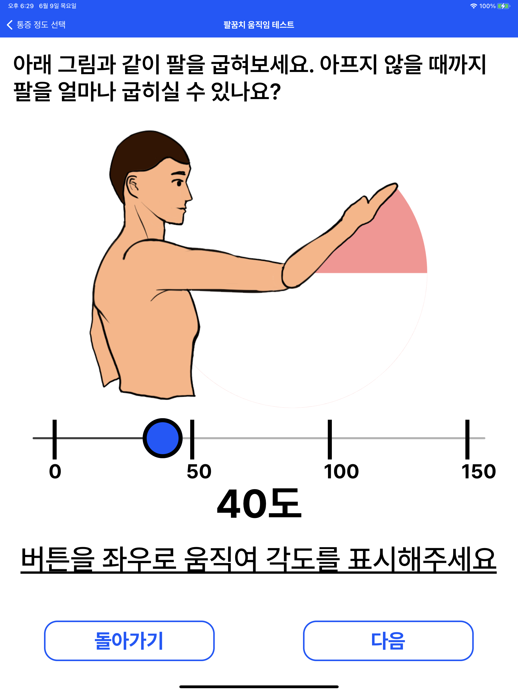
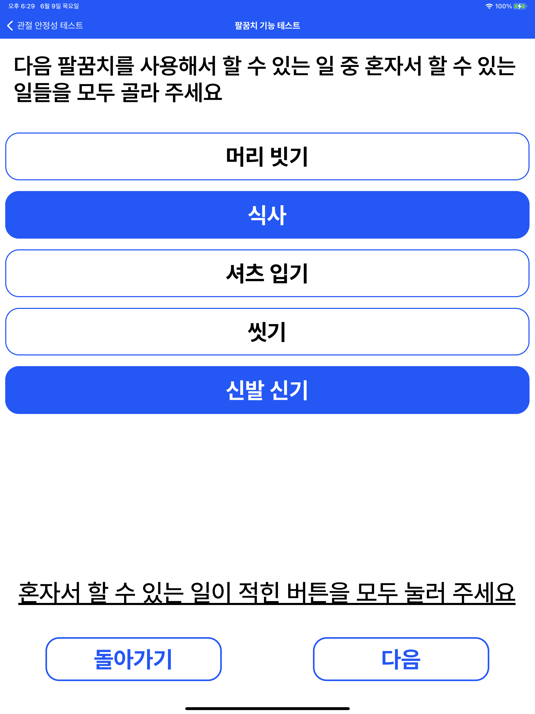

# CSE9115 Medical App

A medical app for orthopedic senior patient impressions

> CSE9115: SPECIAL TOPICS IN HEALTHCARE INFORMATION SOFTWARE

## Screenshots







## Team
- 주한새
- 김유신
- 모지환
- 인전

## Features
- [x] 신체 그림 및 버튼 위주의 타이핑 없는 고령 친화 UI
- [x] 크고 일관성있는 폰트
- [x] 자동 TTS (Text to Speech)
- [x] 효율적 예진 질의 알고리즘
- [x] 예진 결과를 Markdown/html 파일로 저장
- [x] Target OS: iOS
- [ ] Target OS: android

## Setup
### Installation
1. [React Native](https://reactnative.dev/docs/environment-setup)에서 ios용 설치 가이드를 따라 react native 및 simulator 설치
2. 프로젝트 클론
```sh
git clone https://github.com/Verssae/cse9115-medical-app.git
cd cse9115-medical-app
npm install
```
3. `expo-speech`, `expo-constants`, `expo-web-browser` 패키지를 사용하므로 expo-cli 설치 [참고](https://docs.expo.dev/bare/installing-expo-modules/)
```sh
npm install --global expo-cli
npx install-expo-modules@latest
expo install expo-constants expo-speech expo-web-browser
npx pod-install
```
### Run
1. Metro 개발 서버 실행
```sh
npx react-native start
```
2. Simulator 실행 (혹은 xcode를 사용하여 ios 기기 연결)
```sh
npx react-native run-ios # or
npx react-native run-ios --simulator="iPad Pro (12.9-inch) (5th generation)"
```
