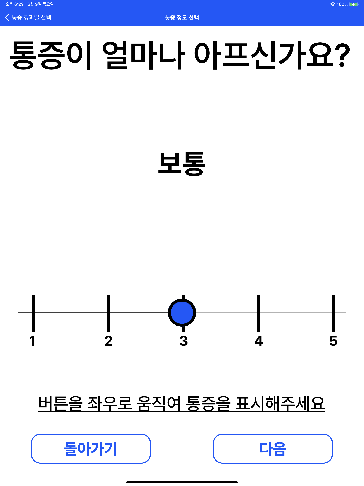

# CSE9115 Medical App

A medical app for orthopedic senior patient impressions

> CSE9115: SPECIAL TOPICS IN HEALTHCARE INFORMATION SOFTWARE

## Screenshots

## Team
- 주한새
- 김유신
- 모지환
- 인전

## Features
- [x] 신체 그림 및 버튼 위주의 타이핑 없는 고령 친화 UI
- [x] 크고 일관성있는 폰트
- [x] 자동 TTS (Text to Speech)
- [x] 효율적 예진 질의 알고리즘
- [x] 예진 결과를 Markdown/html 파일로 저장
- [x] Target OS: iOS
- [ ] Target OS: android

## Setup
### Installation
1. [React Native](https://reactnative.dev/docs/environment-setup)에서 ios용 설치 가이드를 따라 react native 및 simulator 설치
2. 